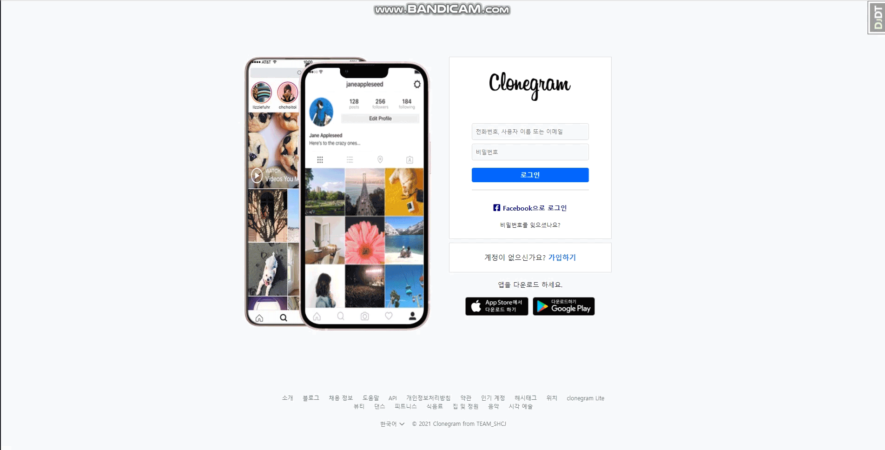
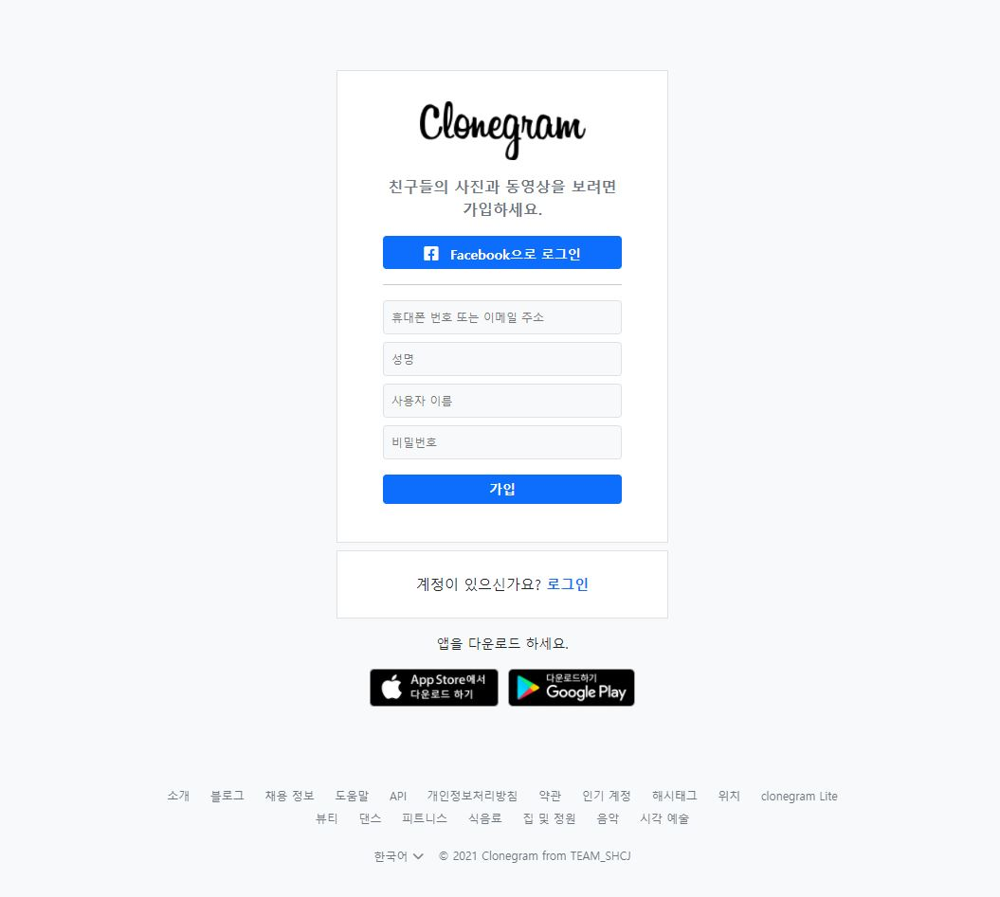

# PJT : CLONEGRAM

#### └ Sub TITLE : clone coding - instagram

#### └ Author : EK_13

>### TO DO
>
>- **\[O] Authentication (사용자 인증)**
>- **\[ ing ] CRUD (데이터 생성 및 조작)**
>- **\[ ] Comment (댓글)**
>- **\[ ] Follow (팔로우)**
>- **\[ ] Search (검색)**
>- **\[ ] profile (프로필 피드)**
>- **\[ ] Like/Dislike (좋아요)**

```
※ Template은 추후 css로 분리 예정 ※
```

---


#### 1. User_APP / Authentication (사용자 인증)

- **User Model**

  ```python
  class User(AbstractUser):
  
  User_fields = [
  	name, user_name, profile_photo, website, bio,
  	email, phone_number, gender, followers, followings
  ]
  
  ----- Detail -----
  - name = CharField
  - user_name = CharField
  - profile_photo = ImageField
  - website = URLField
  - bio = TextField
  - email = CharField
  - phone_number = CharField
  - gender = CharField / choices=GENDER_CHOICE
  	GENDER_CHOICE = [
  		('M', 'Male'),
  		('F', 'Female'),
  		('C', 'Custom')
  	]
  - Followers = ManyToManyField
  - Following = ManyToManyField
  ```

  

- **Base_Template**

  ```
  i) base.html을 활용
  ii) footer.html include하여 활용
  iii) bootstrap_cdn 및 css style 사용하여 레이아웃 디자인
  ```

  

- **Main_page / Login (로그인)**

  - View

    ```python
    "POST" method와 "GET" method 구분
    if reqeust.method == 'POST':
    	return
    else:	# if request.method == "GET" (NOT "POST")
        return
    ```

  - Template

    ```django
    
      <div class="row">
        {# phone_img #}
        <div class="d-none d-md-block col-md-6">
          {# break_point md를 기준으로 node / block 전환 #}
        </div>
        {# login #}
        <div class="col-12 col-md-6 d-flex mt-5">
          {# break_point md를 기준으로 col-12 / 6 전환 #}
        </div>
      </div>
    
    ```

  - 구현 - Login (로그인)

    

  

- **Sign-up_page / Sign-Up (회원가입)**

  - SignUpForm

    ```python
    class SignUpForm(forms.ModelForm):
        
        class Meta:
            model = User
            fields = ['email', 'name', 'username', 'password']
    		widget = {...}
        def save(self, commit=True):
    		...
            return user
    
    ----- Detail -----
    email = TextInput
    name = TextInput
    username = TextInput
    password = PasswordInput
    ```

  - View

    ```python
    "POST" method와 "GET" method 구분
    if reqeust.method == 'POST':
        if form.is_valid():		#유효성 검사
    	return
    else:	# if request.method == "GET" (NOT "POST")
        return
    ```

  - Template

    ```django
    
      {# sign_up #}
      <div class="d-flex justify-content-center mt-5">...</div>
    
    ```
  
    
  
  - 구현 - Sign-Up (회원가입)
  
    

---


#### 1. POST_APP / CRUD (데이터 작성, 조회, 수정, 삭제)

- **TimeStamed Model**

  ```python
  class TimeStamedModel(models.Model):
  	# 작성/수정 시간 코드 중복 작성 방지 및 재사용성 향상을 위한 클래스
  
  TimeStamed_Fields = [
      crated_at, updated_at
  ]
  
  ----- Detail -----
  - created_at = DataTimeField
  - updated_at = DataTimeField
  ```


- **Post Model**

  ```python
  class Post(TimeStamedModel):
      # 작성/수정 시간 상속
  Post_Fields = [
      author, image, caption, image_likes
  ]
  
  ----- Detail -----
  - author = ForeignKey
  	User 모델 상속
      related_name = 'post_author'
  - image = ImageField
  - caption = TextField
  - image_likes = ManyToManyField
  	related_name = 'post_image_likes'
  ```

  

- **Comment Model**

  ```python
  class Comment(TimeStamedModel):
      # 작성/수정 시간 상속
  Comment_Fields = [
      author, posts, contents
  ]
  
  ----- Detail -----
  - author = ForeignKey
  	User 모델 상속
      related_name = 'comment_author'
  - posts = ForeignKey
  	Post 모델 상속
      related_name = 'comment_author'
  - contents = TextField
  ```


- **Base Template**

  ```
  i) post/base.html 활용
  ii) nav.html include 하여 활용
  iii) bootstrap 및 css style을 사용하여 레이아웃 디자인
  ```

  

- **INDEX page**

  - View

    ```python
    # 추후 Follower/Following User 게시물만 보이도록 수정 예정
    posts = models.Post.objects.order_by('-pk').all()[:10]
    ```

  - Template

    ```django
    
      <div class="container">
        <div class="row justify-content-center">
          {# feed #}
          <div class="col-12 col-lg-8" style="width: 640px;">
              
            {# story #}
            <div class="mt-4 p-2 border bg-white" style="height: 120px; font-size: 14px;">...</div>
              
            {# post #}
            
              {# author #}
              <div class="mt-3 p-2 border bg-white">...</div>
    
              {# img #}
              ...
              
              {# caption #}
              <div class="p-2 border bg-white">...</div>
              
              {# comment #}
              <div class="d-flex align-items-center px-2 border border-top-0 bg-white" style="font-size: 20px;">...</div>
    
            
            
          </div>
            
          {# aside #}
          
        </div>
          
      </div>
      <!-- Modal -->
      <div class="modal fade"...>...</div>
    
    ```

  - 구현 (index)

    


